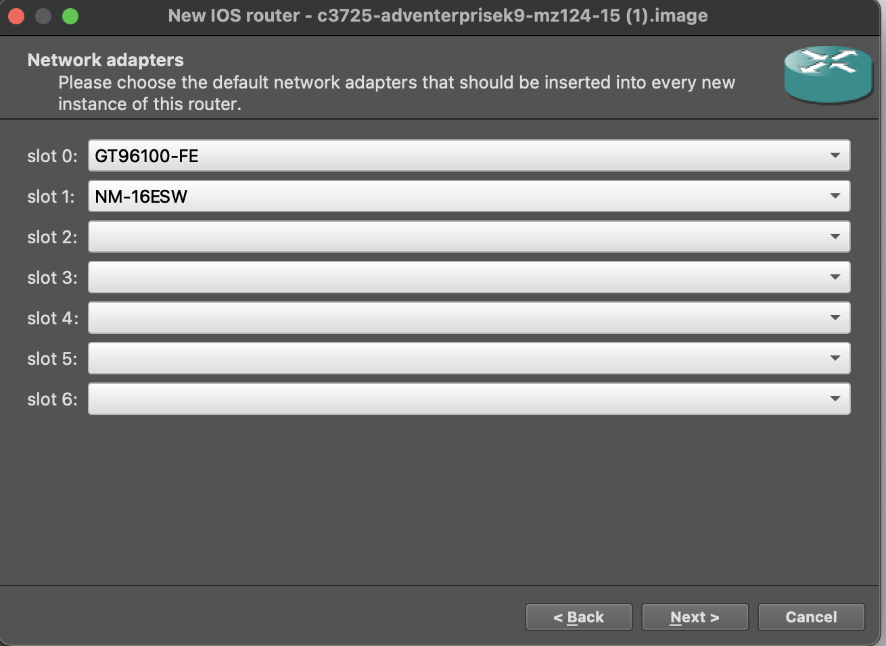

# Лабораторная 1: LAG + STP


## Настройка и установка 
Для работы будем использовать платформу Cisco с3725. Это роутер, но в него можно поставить слот расширения NM-16ESW, который добавит 16 L2 портов. После этого им можно будет пользоваться как свичем.

Качать образ тут: https://mega.nz/folder/nJR3BTjJ#N5wZsncqDkdKyFQLELU1wQ/file/WYRGxRiL

Название файла `c3725-adventerprisek9-mz124-15.bin`

Установка образа в GNS3:

* Preferences -> Dinamips -> IOS routers -> New -> New Image -> Выбираем файл и дальше со всем соглашаемся. 

* В окне Network Adapters доставляем карточку NM-16ESW в слот 1.


* В окне Idle PC жмем на кнопку "Idle-PC finder" и ждем пока найдется значение. Если за несколько попыток не нашлось, то можно пропустить.


## Полезные команды

```shell
# Показать всю информацию обо всех интерфейсах
show interfaces
# Коротко рассказать об интерфейсах
show ip interface brief

# Войти в режим конфигурации
configure terminal

# Показать текущую конфигурацию
show running-config

# Скопировать текущую конфигурацию в стартовую (сохранить)
write

# Исследуйте опции при помощи нажатия "?"
show ?

# Дополняйте команды при помощи клавиши tab
sh<tab>
show

# Зайти в настройки интерфейса F2/0 (внутри режима конфигурации)
interface F2/0

# Настроить несколько интерфейсов одновременно
interface range F2/1 - 2
```


## Настройка LAG
```sh
# Настроить LAG на интерфейсах 2/1, 2/2. 
interface F2/1
    channel-group 1 mode on
    no shutdown

interface F2/2
    channel-group 1 mode on
    no shutdown

```

## Взаимодействие с STP
```sh
# Посмотреть состояние STP
show spanning-tree brief

# Внутри интерфейса  задать стоимость
interface F2/0
    spanning-tree cost 100
```